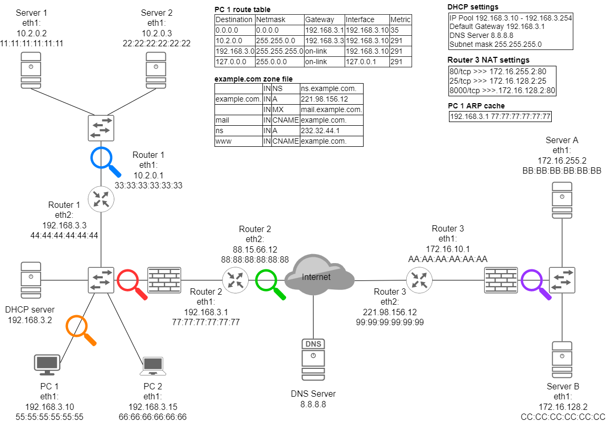

# Network

### What is a network interface? Which OSI layer does it belong to?
### What is subnet mask used for? In case of 10.1.196.15/16 what is the address of the network?
### Which OSI layer do TCP and UDP belong to? What is the difference between them?
### What is a TCP/UDP port?
### What is an ephemeral port?
### Which OSI layer does the switch belong to?
### What does the switch do?
### What is the CAM table? What kind of information does it contain?
### Which OSI layer does the MAC address belong to? What is it used for?
### What is the ARP protocol?
### Which OSI layer does the IP belong to?
### What is the difference between private and public IPs?
### What is the ICMP protocol used for? Which OSI layer does it belong to?
### What does a router do? Which OSI layer does it belong to?
### What does a TCP handshake look like? What is its purpose?
### What is a VLAN?
### What is a trunk port?
### How does the switch decide which VLAN does the packet arriving from its trunk interface belong to?
### What is DHCP? How does it work?
### What is the routing table used for? How does it work?
### What is the difference between static and dynamic routing?
### What is a default gateway?
### Which OSI layer does the HTTP protocol belong to?
### What happens on the network when you open a web page?
### What happens on the network when PC A residing in VLAN 10 sends a packet to PC B also residing on VLAN 10 but on a different switch?
### What happens if PC A and B are in different VLANs?
### How should you address a packet if you want it to reach every host in the subnet?
### Why are routing protocols useful?
### What is native VLAN?
### How does VLAN hopping work? (both methods)
### How can you protect your network against VLAN hopping?
### What is DoS and DDoS?
### What is volumetric DoS?
### What is DNS used for?
### What does the DNS hierarchy look like?
### What does a DNS resolver do?
### What is the difference between a recursive and an iterative query?
### What does a DNS zone file contain?
### What is forward and reverse DNS lookup?
### What information belongs to the following DNS records: A, AAAA, MX, NS, PTR, CNAME?
### What is a firewall? Which OSI layer does it belong to?
### What is an ACL?
### How does a simple (stateless) packet filter work?
### What is the difference between a stateless and a stateful firewall?
### What is deep packet inspection (or protocol inspection)?
### What is NAT? In which OSI layer does it happen?
### What is a web proxy? What it is used for?
### How can you ensure that the client cannot access the internet without using the proxy?
### What is a reverse proxy? What is the difference between a forward and a reverse proxy?
### What is a load balancer?
### How can you sniff the network traffic and save it in a file?
### What is IDS and IPS? How do they work? What is the difference between them?
### What information a DHCP provides to the hosts?
### What is a DHCP static lease?
### How does DHCP snooping work? What protection does it provide?
### How does ARP cache poisoning work?
### How can you defend against ARP cache poisoning?
### How can you prevent an attacker to exfiltrate date from your infrastructure after a successful attack?
### What is command injection vulnerability?
### What is a reverse shell and why it is better than a bind shell?How does portscan work and what it is used forWhat is banner grabbing?How does DNS amplification work?

